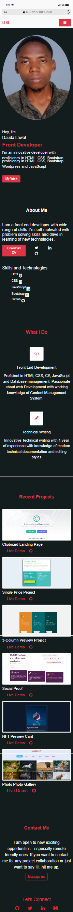

# WEB3BRIDGE - PortFolio Project

This is a solution to my Portfolio Project With Bootstrap WEB2CVII TEAM 1

## Overview

This project was facilitated by WEB3BRIDGE and supervised by @Adetutu777.

**To task was achieved with HTML, CSS and Bootstrap.**

### The Portfolio 

Users should be able to:

- View the optimal layout depending on their device's screen size

### Screenshots

### Links

- Solution URL: (https://github.com/Daslaw/portfolio-web.git)
- Live Site URL:(https://portfolio-web2.netlify.app/)

## My process

- Write and Format the HTML section of the Project
- Styling with Bootstrap
- Pushed and host on Netlify 

### Built with

- Semantic HTML5 markup
- CSS custom properties
- Bootstrap
- AOS-Animation

### Tools

- VScode
- Chrome Browser

### What I learned

- CSS and Efficient use of Bootstrap
- AOS Animation
## Acknowledgments

Thanks to my mentor @Adetutu777 and @WEB3BRIDGE for this opportunity.